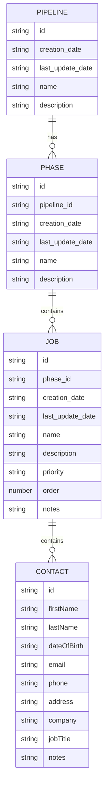

## Entity Relationship Diagram

There are four types of entities:

- Pipeline
    - Meant to group multiple phases together
    - Jobs will move through the various phases of a pipeline
- Phase
    - Holds a collection of jobs
    - The order of the jobs in a phase should matter but is not required
- Job
    - Represents the work that needs to be done
    - Should have at least one contact
- Contact
    - Holds all information about the person
    - Represents the person who is requesting the job.

