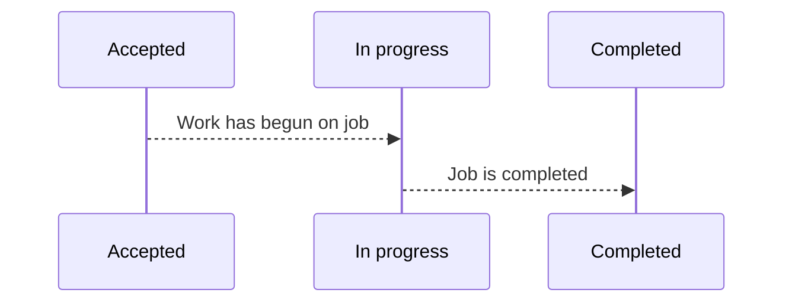

### Job Pipeline

What is a job pipeline?

A job pipeline is meant to track and control the process of jobs. A job can move through several phases before it is
completed. A simple example of a job pipeline is a pipeline with three phases: **accepted**, **in progress**, and
**completed**. When a job is created by the customer or employee, it is first added to the **accepted phase** where it
will remain until the employee can begin the work. Once the employee begins the work, the job is moved to the
**in progress phase**. Once the job is completed, the job is moved to the **completed phase**. Automation can be added
to the job pipeline to fire off tasks when a job moves out or into a phase. An example of this would be to send an
email to the customer when a job moves into the **completed phase**.

### Job Pipeline Example

A job is first added to the **accepted phase** where it will remain until work has started on the job.

